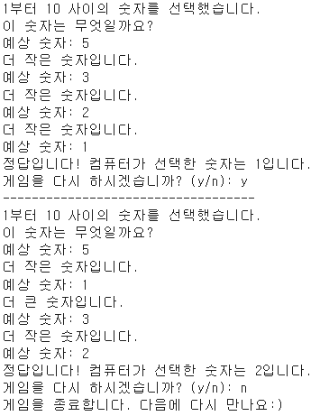

# 🎰 숫자 맞추기 게임
 

## 📄 게임 설명
1. 플레이어가 숫자를 입력
2. 컴퓨터가 생각한 랜덤 숫자와 비교
3. “작다" 혹은 "크다" 힌트를 받아가면서 숫자 맞추기
4. 숫자를 맞추면 게임 종료
 

## 🔎 부가 기능
- 숫자에 대한 “작다" 혹은 "크다" 힌트 제공
 

- 플레이어가 입력을 잘못했을 경우 다시 입력   
    - 입력한 숫자가 범위를 벗어난 경우, 유효한 범위 내의 숫자를 입력하도록 유도
    - 중복된 숫자를 입력한 경우, 중복된 숫자를 제외하고 다시 입력하도록 유도
    - 숫자가 아닌 값을 입력했을 경우, 다시 입력하도록 유도
 

- 게임 재시작 여부를 y, n으로 받아 게임 초기화 또는 종료   
    - 재시작 여부에서 다른 값을 입력했을 경우(잘못된 입력 시) 게임 종료
 

## 게임 결과
- 게임 결과   

 

- 플레이어가 입력을 잘못했을 경우   

 

- 재시작 여부에서 다른 값 입력했을 경우   

