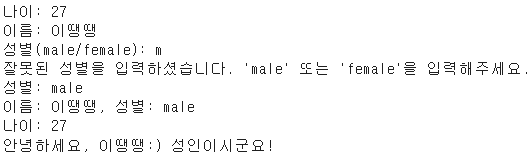

# 📰 사용자의 정보를 나타내는 클래스
 

## 📄 함수 설명
display: 사용자 정보 출력 함수
greet: 나잇대에 맞는 인사 메세지 출력 함수
 

## 🔎 부가 기능
- 이름과 성별은 같은 행에 출력하고 나이는 다음 행에 출력
 

- gender에 잘못된 값을 입력한 경우, 오류 메세지 출력 및 올바른 성별 입력 받을 때까지 질문 반복
 

## 게임 결과
- 게임 결과   

 

- 플레이어가 성별 입력을 잘못했을 경우   

