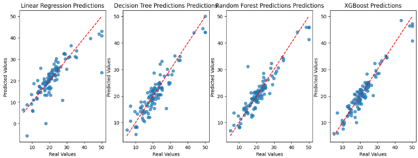
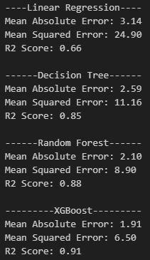

# 🏠지도학습 - 주택 가격 예측 회귀 모델 구축
 

## 데이터셋: housingdata.csv

컬럼별 설명

- CRIM: **마을별 1인당 범죄율**
    - per capita crime rate by town
- ZN: **25,000평방피트 이상의 부지에 대해 구획된 주거용 토지의 비율**
    - proportion of residential land zoned for lots over 25,000 sq.ft
- INDUS
    - proportion of non-retail business acres per town
- CHAS 
    - Charles River dummy variable (1 if tract bounds river; 0 otherwise)
- NOX 
    - nitric oxides concentration (parts per 10 million)
- RM: **주거당 평균 객실 수**
    - average number of rooms per dwelling
- AGE: **1940년 이전에 지어진 소유주 점유의 비율**
    - proportion of owner-occupied units built prior to 1940
- DIS: **보스턴 고용 센터 5곳까지의 가중 거리** 
    - weighted distances to five Boston employment centres
- RAD: **방사형 고속도로 접근성 지수**
    - index of accessibility to radial highways
- TAX: **$10,000당 전액 재산세율**
    - full-value property-tax rate per $10,000
- PTRATIO
    - pupil-teacher ratio by town
- B
    - 1000(Bk - 0.63)^2 where Bk is the proportion of blacks by town
    - 마을별 흑인 비율입니다
- LSTAT 
    - % lower status of the population
- MEDV: **소유주가 거주하는 주택의 중간값 $1000$s**
    - Median value of owner-occupied homes in $1000's

 

## 🤖 예측 모델 개발

1. **데이터셋 탐색 및 전처리**
    - 결측치 처리
    - 이상치 탐지 및 제거
    - 데이터 시각화
    - 상관관계 확인
    - 특징 선택
 

2. **여러 회귀 모델 비교**
    - 선형 회귀
    - 의사결정나무
    - 랜덤 포레스트
    - XGBoost
 

3. **모델 성능 평가**
    - 지표를 사용하여 모델 성능 비교
        - **Mean Absolute Error (MAE)**: 예측값과 실제값의 절대 오차의 평균
        - **Mean Squared Error (MSE)**: 예측값과 실제값의 제곱 오차의 평균 (0에 가까울수록 좋음)
        - **Root Mean Squared Error (RMSE)**
        - **R² Score**: 모델이 데이터의 변동성을 얼마나 설명하는지 나타내는 지표 (1에 가까울수록 좋음)
 

4. **결과 분석**
    - 각 모델의 성능을 비교하고, 최적의 모델을 선택하여 결과를 시각화
        - **시각화**: 성능 지표를 matplotlib 또는 seaborn을 사용하여 막대 그래프 그리기   
&nbsp;&nbsp;&nbsp;&nbsp;&nbsp;&nbsp;&nbsp;&nbsp;&nbsp;&nbsp;&nbsp;&nbsp;&nbsp;&nbsp;&nbsp;-> 시각화해서 쉽게 비교할 수 있도록 함

### 🗃️ 모델 성능 결과
#### 결측치를 모두 평균 값으로 대체한 경우
예측 결과 시각화     

모델 별 평가 결과    

